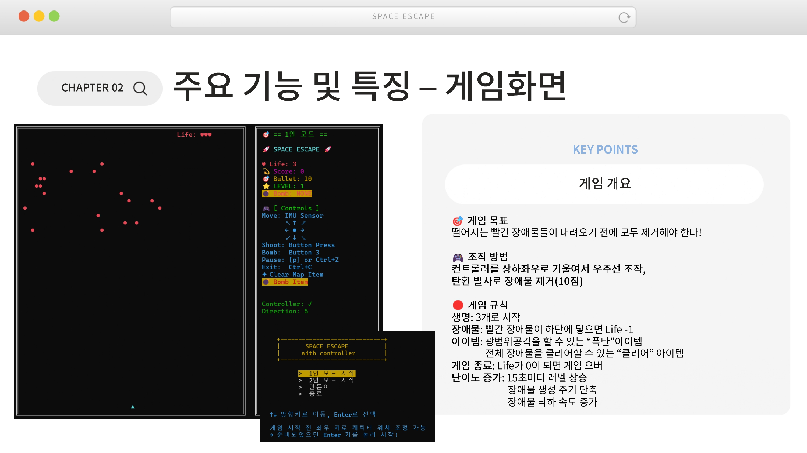

# 🚀 라즈베리파이 IMU 게임 컨트롤러  
**I2C, GPIO, 쓰레드, 소켓 프로그래밍 기반의 실시간 멀티플레이 '우주선 피하기' 게임**


---

## 📌 프로젝트 개요

이 프로젝트는 ADXL345 IMU 센서와 GPIO 버튼을 이용한 **모션 기반 게임 컨트롤러**를 설계하고, 두 라즈베리파이 간 **TCP 소켓 통신**을 통해 실시간 경쟁 게임을 구현한 시스템입니다.  
커널 드라이버, 디바이스 파일 제어, 쓰레드, ncurses 그래픽 등 **시스템 프로그래밍의 핵심 요소**를 종합적으로 활용하였습니다.

## 🎯 목표 및 동기

- 실제 **디바이스 드라이버 및 시스템 콜 기반 프로그래밍**을 경험하고자 함
- 쓰레드와 소켓, I/O 등의 시스템 자원을 직접 활용하는 **임베디드 게임 시스템**을 제작
- "재미있고 직관적인 리얼타임 시스템" 구현

---

## 🕹️ 게임 설명: Space Escape

플레이어는 IMU 센서를 통해 우주선을 좌우로 조작하며 버튼으로 탄환 발사, 아이템 사용을 할 수 있습니다. 위에서 떨어지는 장애물(운석)이 바닥에 닿지 않도록 합니다.  
또한 2인 멀티플레이 모드에서는 서로 점수를 겨뤄 승자를 결정하게 됩니다.

- **좌우 이동**: IMU 기울기
- **버튼 입력**: 탄환 발사, 아이템 사용 등  
- **게임 모드**:
  - 1인 모드
  - 2인 경쟁 모드

---

## 🧩 시스템 구조

```plaintext
[ IMU / Button ] --> [ Device Driver (/dev/imu_dev) ]
                              |
                              v
                    [ User App - Controller Thread ]
                              |
                              v
       [ Game Engine ] <--> [ Socket Communication ] <--> [ Opponent ]
                              |
                              v
                        [ ncurses UI ]
```

- **IMU 입력**
  - 센서: ADXL345 (3축 가속도, I2C)
  - 드라이버: 커널 모듈 작성 → `/dev/imu_dev`로 사용자 접근 가능
- **버튼 입력**
  - GPIO 기반 주기적 상태 확인 (`polling` 방식)
- **멀티스레드 구조**
  - IMU/버튼 입력을 별도 스레드에서 비동기 처리
  - 메인 게임 로직은 입력 큐로부터 이벤트 수신
- **소켓 통신**
  - TCP 기반 클라이언트-서버 구조 (스레드마다 소켓 핸들)
  - 서버는 클라이언트 접속마다 스레드 생성

---

## ⚙️ 구현 기술 요약

| 기술 요소         | 설명 |
|------------------|------|
| **센서 제어**       | I2C 통신 / ADXL345 / `ioctl()` |
| **디바이스 드라이버** | `/dev/imu_dev` 생성 / read 기반 사용자 접근 |
| **버튼 이벤트**     | GPIO + 주기적 polling (`gpiod_line_get_value()`) |
| **소켓 통신**       | `socket()`, `bind()`, `connect()`, `recv()`, `send()` |
| **스레드 처리**     | `pthread_create()`, `pthread_join()` 등 |
| **화면 출력**       | ncurses 기반 텍스트 UI / flicker 최소화 |
| **시스템콜 활용**   | 총 19종 시스템 콜 적용 |

---

## 📂 프로젝트 구조

```
space_escape/
├── build/                    # 빌드 산출물 (바이너리 등) 디렉토리
├── docs/                    
├── include/                  # 프로젝트 전역 헤더 파일
│   ├── common.h              # 공통 상수
│   ├── controller.h          # 컨트롤러 관련
│   ├── game_parameter.h      # 게임 설정 값 정의
│   ├── game.h                # 게임 로직 관련 헤더
│   ├── intro_ui.h            # 시작 UI 관련 헤더
│   └── network.h             # 네트워크 관련 헤더
│   └── thread_utils.h        # 스레드 관련 유틸
├── presentation_note/        # 발표 관련 자료
├── server/                   # 서버 및 클라이언트 테스트 코드
│   ├── server.c              # 서버 메인 코드
│   ├── test_client.c         # 클라이언트 기능 테스트
│   └── test_server.c         # 서버 기능 테스트
├── src/                      
│   ├── controller/           # 컨트롤러 입력 처리 관련 코드
│   │   ├── controller.c
│   │   └── switch_test.c
│   ├── game/                 # 게임 로직 및 UI
│   │   ├── game.c
│   │   └── intro_ui.c
│   ├── network/              # 소켓 통신 구현
│   │   └── network.c
│   ├── utils/
│   │   └── thread_utils.c
│   └── main.c                # 메인 실행 파일
├── Makefile                  # 빌드 스크립트
└── README.md 
```
---

## 🔧 빌드 및 실행 방법

### 📦 1. 의존 라이브러리 설치

```bash
sudo apt-get update
sudo apt-get install libgpiod-dev
```

### 🧱 2. 빌드

```bash
make
```

### 🚀 3. 게임 실행 (컨트롤러 사용)

```bash
sudo ./space_escape
```

---

## ⚠️ 컨트롤러 없이 실행하고 싶다면?

컨트롤러 없이 테스트하려면, 가상 입력을 사용하는 더미 버전으로 전환하세요:

```bash
# 기존 controller.c 백업
mv src/controller/controller.c src/controller/controller_hw.c

# 더미 컨트롤러 코드로 교체
cp src/controller/controller.c~ src/controller/controller.c

# 다시 빌드
make clean
make

# 실행
sudo ./space_escape
```


---

## 🗓️ 버전 히스토리

| 버전 | 주요 변경사항 |
|------|----------------|
| v0.1.0 | 기본 게임 구현 및 UI 구성 시작 |
| v0.2.0 | 컨트롤러 테스트 / 난이도 조정 |
| v0.3.0 | 코드 리팩터링 및 구조 정리 |
| v0.4.0 | 소켓 통신 및 네트워크 구조 설계 |
| v0.5.0 | 서버 메시지 시스템 재설계 / 2인 대기방 구현 |
| v0.6.0 | UI 깜빡임 개선, 예외처리 강화 |
| v0.7.0 | 동기화 개선, 서버 이탈 처리 |
| v0.8.0 | 게임 시작 시 seed 공유로 상태 일관성 보장 |
| v0.9.0 | 컨트롤러 버튼 추가, 게임과 연동 |
| v1.0.0 | 게임 아이템 추가, 게임 UI개선 |

---

## 🎬 시연 영상

### 🔹 1인 경쟁 모드  
[](https://youtu.be/-aqC0NLWS3E)  
🔗 https://youtu.be/-aqC0NLWS3E

&nbsp;

### 🔹 2인 협동 모드  
[](https://youtu.be/F4oVLLpWjE0)  
🔗 https://youtu.be/F4oVLLpWjE0


---

## 🖼️ 게임 소개 이미지

게임 개요 요약 (발표자료 중 슬라이드 1):




---

## 🙌 참여 및 문의

본 프로젝트는 **경북대학교 시스템 소프트웨어 강의**의 팀 과제로 수행되었습니다.  
기술 문의 및 협업 제안은 GitHub Issue 또는 Pull Request로 환영합니다.

---

© 2025 Team 5 - KNU ELEC462 System Programming
